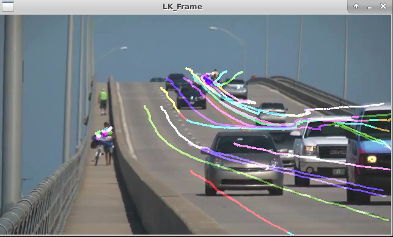
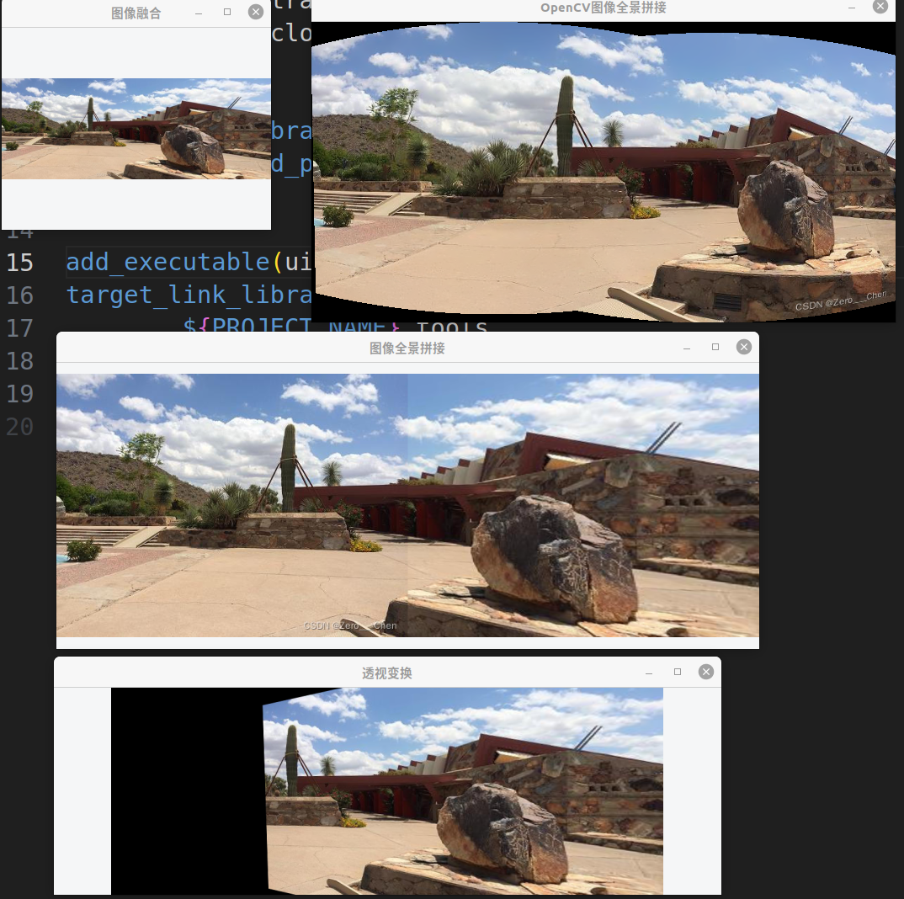
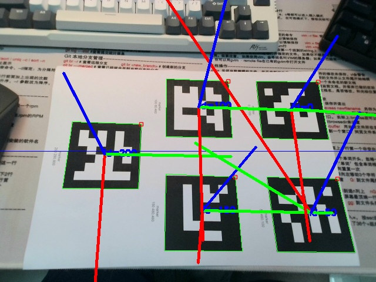
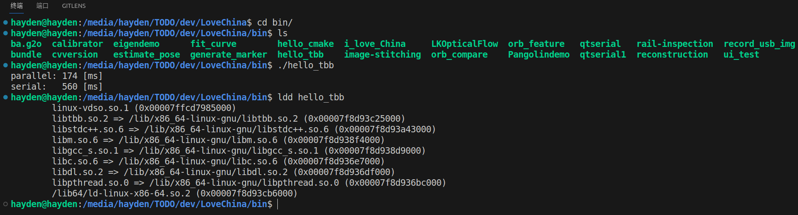

对应博客：https://blog.csdn.net/u011341856/article/details/102408063?spm=1001.2014.3001.5501

## How to use?

Enter the root directory of the current file, then open terminal!

``mkdir build``

``cd build``

``cmake ..``

``make ``

## 01 LK

```
wget https://www.bogotobogo.com/python/OpenCV_Python/images/mean_shift_tracking/slow_traffic_small.mp4
./LKOpticalFlow
```

`ubuntu@acd4ed39dee8:~/Dev/docker/u18_cuda/LoveChina/scripts/OpenCV$ python lkflow.py `



```
sudo apt install -y ros-noetic-pcl-ros ros-noetic-velodyne-msgs libopencv-dev libgoogle-glog-dev libeigen3-dev libsuitesparse-dev libpcl-dev libyaml-cpp-dev libbtbb-dev libgmock-dev 
sudo apt install libcanberra-gtk-module
```

编译g2o到make即可
编译Pangolin到make即可

注意opencv编译时打开

```
OCV_OPTION(OPENCV_ENABLE_NONFREE "Enable non-free algorithms" ON)
```

上面似乎不奏效，还是在cmake时设置

```
cmake -D CMAKE_BUILD_TYPE=RELEASE -D CMAKE_INSTALL_PREFIX=/home/ubuntu/Dev/docker/u18_cuda/App/opencv345/Install/ -D OPENCV_EXTRA_MODULES_PATH=/home/ubuntu/Dev/docker/u18_cuda/App/opencv345/opencv_contrib/modules/ -D WITH_CUDA=OFF -D BUILD_DOCS=OFF -D BUILD_EXAMPLES=OFF -D BUILD_TESTS=OFF -D BUILD_PERF_TESTS=OFF -DOPENCV_ENABLE_NONFREE:BOOL=TRUE ..
```



### 生成marker

```
../bin/generate_marker 6X6_250 0 50 100 150 200
```

"6X6_250"指的是字典名，表示生成一个拥有250个6X6 marker的字典

"0 50 100 150 200"marker的id号，需要生成几个marker就在后面写几个id

### 普通相机位姿估计

```
../bin/estimate_pose 6X6_250 ../config/param.yaml ../../Figs/0.jpg
```

"param.yaml"配置文件，包含相机内参和实际打印出来的marker的边长

"0.jpg"测试照片

结果:


```
marker 0 : rvec->[1.87135,1.91877,-0.346457], tvec->[0.0138539,0.0666454,0.234551]
marker 1 : rvec->[1.78666,1.90724,-0.646364], tvec->[0.110677,0.0647166,0.21952]
marker 2 : rvec->[1.95008,1.95168,-0.199137], tvec->[-0.0863286,0.0133206,0.251713]
marker 3 : rvec->[2.02278,2.05034,-0.347798], tvec->[0.11477,-0.0359532,0.271804]
marker 4 : rvec->[1.98997,1.99299,-0.274266], tvec->[0.0113914,-0.0375248,0.269299]
```

### 鱼眼相机位姿估计

```
../bin/estimate_pose 6X6_250 ../config/fisheye_param.yaml ../data/test_fisheye.jpg
```

"fisheye_param.yaml"配置文件，包含鱼眼相机内参和实际打印出来的marker的边长

"test_fisheye.jpg"测试照片
未实现

### 标定

```
../bin/calibrator ../config/param.yaml
```

结果保存在 "out_camera_data.xml"文件中

### 配置文件解释

```
<?xml version="1.0"?>
<opencv_storage>
<Settings>
  <!-- 标定板尺寸 -->
  <BoardSize_Width> 9</BoardSize_Width>
  <BoardSize_Height>6</BoardSize_Height>
  
  <!-- 标定板栅格大小(单位mm) -->
  <Square_Size>70</Square_Size>
  
  <!-- 标定板类型(默认选择棋盘格) -->
  <Calibrate_Pattern>"CHESSBOARD"</Calibrate_Pattern>
  
  <!-- 输入数据源
  	如果选择相机在线标定，直接将下面的Input参数置为"相机id"
  	如果选择输入视频进行标定，Input参数置为视频路径"video.mp4"
  	如果选择抓拍的图片集进行标定，则Input参数设置为相片集路径配置文件(如下面默认配置所示)
  	-->
  <Input>"/home/cn/learn/opencv_demo/calibrate/config/img_path.xml"</Input>
  
  <!--  If true (non-zero) we flip the input images around the horizontal axis.-->
  <Input_FlipAroundHorizontalAxis>0</Input_FlipAroundHorizontalAxis>
  
  <!-- Time delay between frames in case of camera. -->
  <Input_Delay>100</Input_Delay>
  
  <!-- How many frames to use, for calibration. -->
  <Calibrate_NrOfFrameToUse>11</Calibrate_NrOfFrameToUse>
  <!-- Consider only fy as a free parameter, the ratio fx/fy stays the same as in the input cameraMatrix. 
	   Use or not setting. 0 - False Non-Zero - True-->
  <Calibrate_FixAspectRatio> 1 </Calibrate_FixAspectRatio>
  <!-- If true (non-zero) tangential distortion coefficients  are set to zeros and stay zero.-->
  <Calibrate_AssumeZeroTangentialDistortion>1</Calibrate_AssumeZeroTangentialDistortion>
  <!-- If true (non-zero) the principal point is not changed during the global optimization.-->
  <Calibrate_FixPrincipalPointAtTheCenter> 1 </Calibrate_FixPrincipalPointAtTheCenter>
  
  <!-- The name of the output log file. -->
  <Write_outputFileName>"out_camera_data.xml"</Write_outputFileName>
  <!-- If true (non-zero) we write to the output file the feature points.-->
  <Write_DetectedFeaturePoints>1</Write_DetectedFeaturePoints>
  <!-- If true (non-zero) we write to the output file the extrinsic camera parameters.-->
  <Write_extrinsicParameters>1</Write_extrinsicParameters>
  <!-- If true (non-zero) we show after calibration the undistorted images.-->
  <Show_UndistortedImage>1</Show_UndistortedImage>
  
  <!-- 是否使用鱼眼模型进行标定，如果是鱼眼相机的标定，此处一定要设置为1，否则标定结果很烂 -->
  <Calibrate_UseFisheyeModel>0</Calibrate_UseFisheyeModel>
  <!-- If true (non-zero) distortion coefficient k1 will be equals to zero.-->
  <Fix_K1>0</Fix_K1>
  <!-- If true (non-zero) distortion coefficient k2 will be equals to zero.-->
  <Fix_K2>0</Fix_K2>
  <!-- If true (non-zero) distortion coefficient k3 will be equals to zero.-->
  <Fix_K3>0</Fix_K3>
  <!-- If true (non-zero) distortion coefficient k4 will be equals to zero.-->
  <Fix_K4>1</Fix_K4>
  <!-- If true (non-zero) distortion coefficient k5 will be equals to zero.-->
  <Fix_K5>1</Fix_K5>
</Settings>
</opencv_storage>

```

注: 以上用中文注释的参数需要了解并根据需求配置之外，其它参数可以使用默认的．

### 标定结果


## tbb



[](http://wiki.ros.org/noetic) &nbsp;
[](https://ubuntu.com/) &nbsp;
[](http://docs.ros.org/en/humble/index.html) &nbsp;
[](https://ubuntu.com/) &nbsp;
[](https://github.com/mangdangroboticsclub/gpt4_ros2/blob/main/LICENSE) &nbsp;


# ros-install-one-click

This is a collection of one-click shell scripts for installing and using common tools for robotics, including ROS1, ROS2, camera, MoveIt, and simulators. 

With these scripts, you can install ROS and other tools with one click, and then use robot tools conveniently with the help of the scripts.


## ROS 1 Noetic Installation
To install `ROS1 Noetic` with a single command, copy and execute the following command in the terminal:

```bash
wget -O $HOME/ros1_noetic_install.sh https://raw.githubusercontent.com/auromix/ros-install-one-click/main/ros1_noetic_install.sh && sudo chmod +x $HOME/ros1_noetic_install.sh && sudo bash $HOME/ros1_noetic_install.sh && rm $HOME/ros1_noetic_install.sh
```
## ROS 2 Humble Installation
To install `ROS2 Humble` with a single command, copy and execute the following command in the terminal:

```bash
wget -O $HOME/ros2_humble_install.sh https://raw.githubusercontent.com/auromix/ros-install-one-click/main/ros2_humble_install.sh && sudo chmod +x $HOME/ros2_humble_install.sh && bash $HOME/ros2_humble_install.sh && rm $HOME/ros2_humble_install.sh
```

## MoveIt 1 Installation
To install `MoveIt for ROS1 Noetic` with a single command, copy and execute the following command in the terminal:

```bash
wget -O $HOME/moveit1_install.sh https://raw.githubusercontent.com/auromix/ros-install-one-click/main/moveit1_install.sh && sudo chmod +x $HOME/moveit1_install.sh && sudo bash $HOME/moveit1_install.sh && rm $HOME/moveit1_install.sh
```

## Intel realsense D400 series camera Installation
To install `realsense D400 series camera` with a single command, copy and execute the following command in the terminal:

```bash
wget -O $HOME/realsense_d400_series_install.sh https://raw.githubusercontent.com/auromix/ros-install-one-click/main/realsense_d400_series_install.sh && sudo chmod +x $HOME/realsense_d400_series_install.sh && bash $HOME/realsense_d400_series_install.sh
```

To install `Realsense for Nvidia Jetson Orin` with a single command, copy and execute the following command in the terminal:

```bash
wget -O $HOME/realsense_install_nvidia.sh https://raw.githubusercontent.com/auromix/ros-install-one-click/main/realsense_install_nvidia.sh && sudo chmod +x $HOME/realsense_install_nvidia.sh && bash $HOME/realsense_install_nvidia.sh && rm $HOME/realsense_install_nvidia.sh
```
## Orbbec Femto Bolt Installation
To install `Orbbec Femto Bolt Camera ROS1 Noetic version` with a single command, copy and execute the following command in the terminal:

```bash
wget -O $HOME/orbbec_femto_bolt_ros1_install.sh https://raw.githubusercontent.com/auromix/ros-install-one-click/main/orbbec_femto_bolt_ros1_install.sh && sudo chmod +x $HOME/orbbec_femto_bolt_ros1_install.sh && bash $HOME/orbbec_femto_bolt_ros1_install.sh && rm $HOME/orbbec_femto_bolt_ros1_install.sh
```

To install `Orbbec Femto Bolt Camera ROS2 Humble version` with a single command, copy and execute the following command in the terminal:


```bash
wget -O $HOME/orbbec_femto_bolt_ros2_install.sh https://raw.githubusercontent.com/auromix/ros-install-one-click/main/orbbec_femto_bolt_ros2_install.sh && sudo chmod +x $HOME/orbbec_femto_bolt_ros2_install.sh && bash $HOME/orbbec_femto_bolt_ros2_install.sh && rm $HOME/orbbec_femto_bolt_ros2_install.sh
```

### Microsoft Azure Kinect DK Installation

To install `Azure Kinect DK` with a single command, copy and execute the following command in the terminal:

```bash
wget -O $HOME/azure_kinect_dk_install.sh https://raw.githubusercontent.com/auromix/ros-install-one-click/main/azure_kinect_dk_install.sh && sudo chmod +x $HOME/azure_kinect_dk_install.sh && bash $HOME/azure_kinect_dk_install.sh
```
### Isaac Sim python assistant
The `Isaac Sim python assistant` script facilitates the execution of an Isaac Sim standalone Python script provided by the user.
```bash
# Go to your isaac sim standalone python directory
cd <your_python_directory>
# Download the script
wget https://raw.githubusercontent.com/auromix/ros-install-one-click/main/isaacsim_python_assistant.sh
# Grant execute permission
chmod +x isaacsim_python_assistant.sh
```
```bash
# Go to your isaac sim standalone python directory
cd <your_python_directory>
# Run the script to launch your isaac sim standalone python file
./isaacsim_python_assistant.sh
```
### Config Static IP
This script provides a command-line method to configure a static IP address for an Ethernet interface on a robot. It is particularly useful when a graphical user interface (GUI) is not easily accessible or feasible.
```bash
./config_static_ip.sh
```
### Test CUDA
This script test your CUDA and Pytorch environment.

```bash
wget https://raw.githubusercontent.com/auromix/ros-install-one-click/main/test_cuda.py && python3 test_cuda.py
```


# NDT_PCL_demo
使用PCL实现正态分布变换配准的例子

使用：

```bash
cd build
cmake ..
make
./normal_distributions_transform cloud1.pcd cloud2.pcd
```
